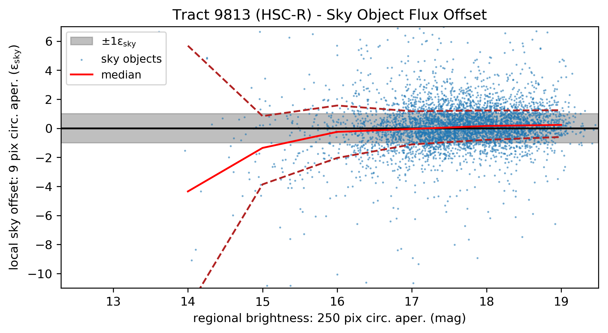
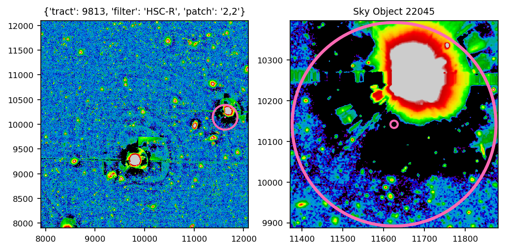
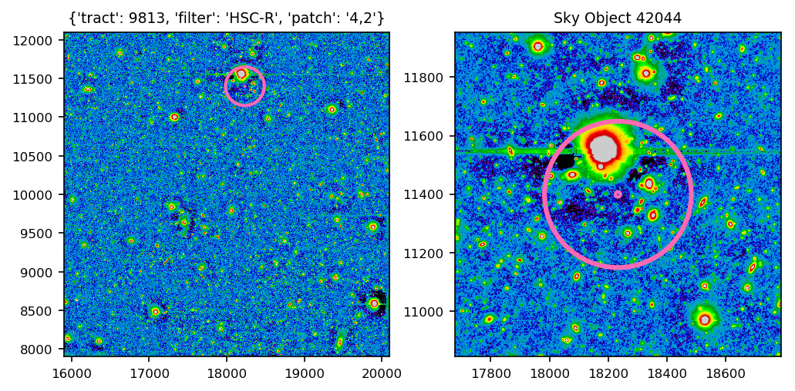
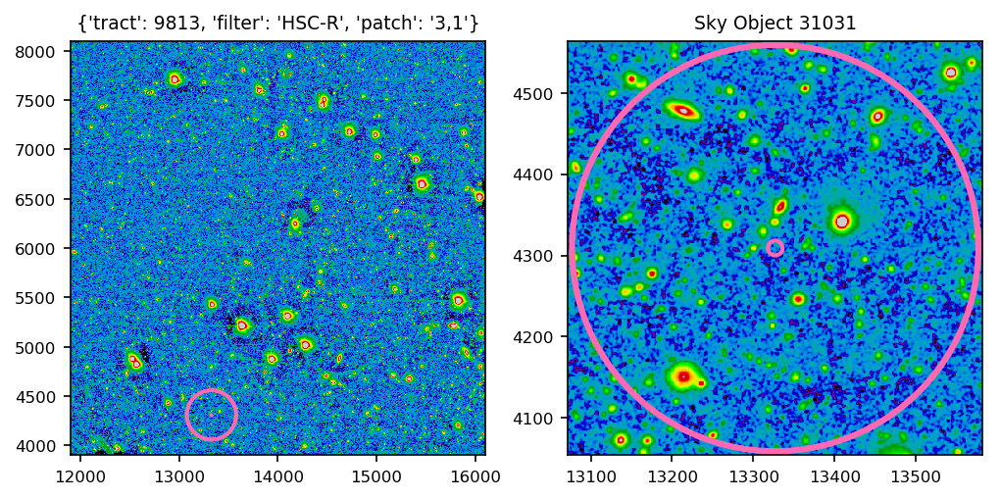

# Quantify Local Sky Over-Subtraction

Can sky object statistics be used to help quantify how much flux is being over-/under-subtracted around bright sources?

Here we use sky objects generated on DEEP data to explore the sky level ('local sky') as a function of regional source flux. A sky object is a pseudo-object artifically injected into the coadd processing run prior to the measurement step. They are defined to have a radius of 8 pixels, and are placed such that no pixel within this radius overlaps with any other detection footprint. Pointings are tested as to whether or not they meet this criteria, stopping when it reaches 100 successful pointings per patch or 500 attempts, whichever comes first.

In the first half of this notebook, we create a re-run of DM-21386 for tract 9813, patch 2,2 in the r-band on the command line. The second half of this notebook expands our analyses to the entire tract.

## Final Results

## Sky Object 22045: Extreme Oversubtraction

## Sky Object 42044: Moderate Oversubtraction

## Sky Object 31031: No Oversubtraction/Undersubtraction

