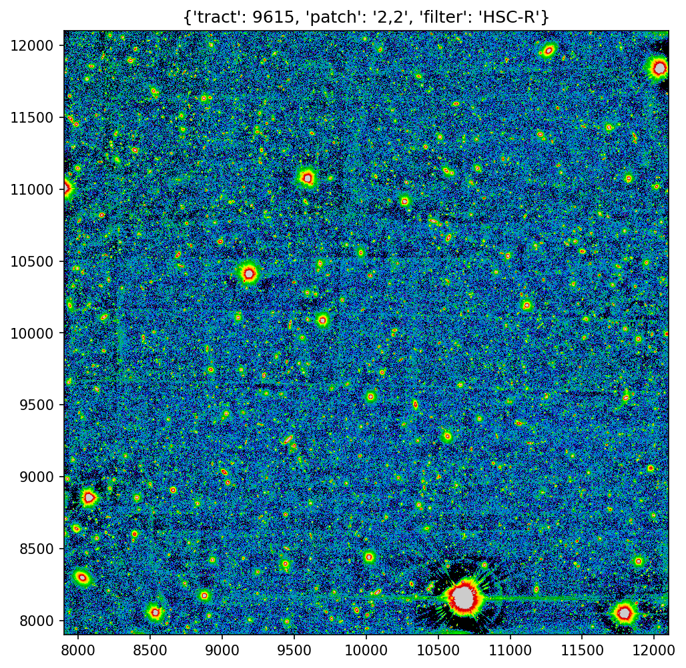

# What Are Patches of Sources Overdensities?

What are dense patches of sources that crop up in out catalogues?

We take a re-run of tract 9615 and look at the r-band deepCoadd forced src catalogue. Images below are r-band when monochrome, and gri when RGB. We will use these data to determine dense regions in the catalogue, performing an n-th nearest neighbour match. Having identified suitably clumped regions, we will take a closer look to see what's going on.

## N-th Nearest Neighbour Offset

## Tract 9615 Patch 2,2 HSC-R

## Tract 9615 Patch 2,2 HSC-R Clumps

## Tract 9615 Patch 2,2 RGB

## Tract 9615 Patch 2,2 RGB Clumps

## Tract 9615 Patch 2,2 HSC-R Zoom 1

## Tract 9615 Patch 2,2 HSC-R Zoom 1 Clumps

## Tract 9615 Patch 2,2 RGB Zoom 1

## Tract 9615 Patch 2,2 RGB Zoom 1 Clumps

## Tract 9615 Patch 2,2 RGB Zoom 2

## Tract 9615 Patch 2,2 RGB Zoom 2 Clumps

## Tract 9615 Patch 4,4 RGB Zoom 3

## Tract 9615 Patch 4,4 RGB Zoom 3 Clumps

